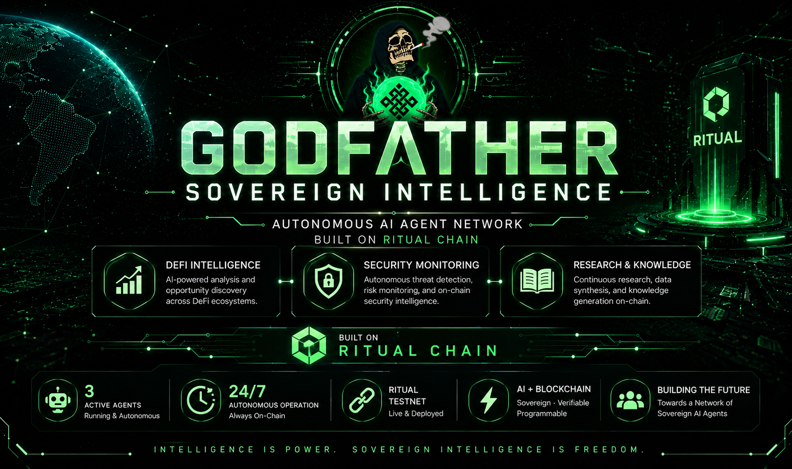

<p align="center">
  
</p>

<h1 align="center">Godfather Sovereign Intelligence</h1>

<p align="center">
<b>A Modular Network of Sovereign AI Agents Built on Ritual Chain</b>
</p>

---

## Overview

Godfather Sovereign Intelligence is an open-source portfolio project that demonstrates how multiple specialized Sovereign AI Agents can operate together as a unified intelligence network on Ritual Chain.

Instead of relying on a single general-purpose agent, this project explores a modular architecture where each AI agent is responsible for a dedicated domain such as decentralized finance, security monitoring, and research.

The long-term objective is to build an extensible ecosystem of autonomous agents capable of collaborating, sharing intelligence, and executing domain-specific tasks on-chain.

---

## Vision

Build a scalable Sovereign AI ecosystem where specialized agents collaborate autonomously to deliver trustworthy intelligence, monitoring, and decision support across the Ritual ecosystem.

---

## Why This Project Exists

Most AI agent demonstrations focus on deploying a single autonomous agent.

Godfather Sovereign Intelligence takes a different approach.

This project explores how multiple specialized Sovereign AI Agents can operate together as a modular intelligence network. Each agent is designed with a focused responsibility while contributing to a broader ecosystem of autonomous collaboration.

Beyond demonstrating deployment on Ritual Chain, this repository serves as a public engineering portfolio documenting the evolution of a scalable Sovereign AI architecture.

---

## Active Sovereign Agents

| Agent             | Specialization       | Status   |
| ----------------- | -------------------- | -------- |
| Godfather DeFi    | DeFi Intelligence    | ✅ Active |
| Ritual Sentinel   | Security Monitoring  | ✅ Active |
| Ritual Researcher | Research & Knowledge | ✅ Active |

---

## Current Network

| Agent             | Harness                                      | Status    |
| ----------------- | -------------------------------------------- | --------- |
| Godfather DeFi    | `0x1880B3E05B552Fa24F7EDfa74AC5A34B9F062744` | 🟢 Active |
| Ritual Sentinel   | `0x32596934e37c27806A72c9D8Fb34FdCFB9B554E4` | 🟢 Active |
| Ritual Researcher | `0x3c0312c5D7232a661E7181674A07111Ab3463577` | 🟢 Active |

---

## Deployment Status

* ✅ 3 Sovereign Agents successfully deployed
* ✅ All Harnesses configured
* ✅ Agents funded
* ✅ Scheduled execution enabled
* ✅ Running on Ritual Testnet

---

## Technical Stack

| Category        | Technology                       |
| --------------- | -------------------------------- |
| Language        | Python                           |
| AI Framework    | Ritual Sovereign Agent Framework |
| Network         | Ritual Testnet                   |
| Wallet          | EVM Compatible Wallet            |
| Version Control | Git & GitHub                     |
| Documentation   | Markdown                         |

---

## Repository Structure

```text
agents/
docs/
images/
scripts/
README.md
```

---

## Roadmap

### Phase 1

* Repository Foundation
* Initial Agent Deployment
* Documentation

### Phase 2

* Architecture Diagram
* Agent Documentation
* Deployment Evidence

### Phase 3

* Monitoring Dashboard
* Additional Sovereign Agents
* Automation Scripts

### Phase 4

* Public Portfolio
* Technical Articles
* Community Showcase

---

## Future Expansion

The Godfather Sovereign Intelligence network is designed to grow beyond its initial three agents.

Future specialized agents may include:

* Portfolio Manager
* On-chain Analyst
* Governance Advisor
* AI Auditor
* Market Intelligence Agent
* Risk Assessment Agent

---

Built with ❤️ on Ritual Chain.
